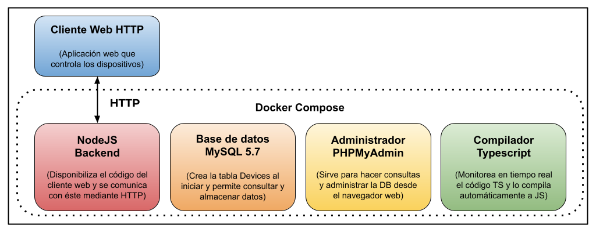

Backend NodeJs + Mysql
======================


Este proyecto es una aplicación backend que se ejecuta sobre el ecosistema `Docker`. Está compuesta por un compilador de `TypeScript` que te permite utilizar este superset de JavaScript para poder programar un `backend`. También tiene un servicio en `NodeJS` que te permite ejecutar código en backend y al mismo tiempo disponibilizar el código del cliente web para interactar con el servicio. Además tiene una `base de datos` MySQL que puede interactuar con el backend para guardar y consultar datos, y de manera adicional trae un `administrador` de base de datos para poder administrar la base en caso que lo necesites.

La aplicación backend es la encargada de obtener datos almacenados en la base de datos con el fin de cumplir las pautas de trabajo de fin de curso de la materia Desarrollo de Aplicaciones Multiplataforma.

## Comenzando 🚀

Esta sección es una guía con los pasos escenciales para que puedas poner en marcha la aplicación.

<details><summary><b>Mira los pasos necesarios</b></summary><br>

### Instalar las dependencias

Para correr este proyecto es necesario que instales `Docker` y `Docker Compose`. 

En [este artículo](https://www.gotoiot.com/pages/articles/docker_installation_linux/) publicado en la web `gotoiot` están los detalles para instalar Docker y Docker Compose en una máquina Linux. Si querés instalar ambas herramientas en una Raspberry Pi podés seguir [este artículo](https://www.gotoiot.com/pages/articles/rpi_docker_installation) de nuestra web que te muestra todos los pasos necesarios.

En caso que quieras instalar las herramientas en otra plataforma o tengas algún incoveniente, podes leer la documentación oficial de [Docker](https://docs.docker.com/get-docker/) y también la de [Docker Compose](https://docs.docker.com/compose/install/).

Continua con la descarga del código cuando tengas las dependencias instaladas y funcionando.

### Descargar el código

Para descargar el código, lo más conveniente es que realices un `fork` de este proyecto a tu cuenta personal haciendo click en [este link](https://github.com/fedepacher/APIRest-DAM/fork). Una vez que ya tengas el fork a tu cuenta, descargalo con este comando (acordate de poner tu usuario en el link):

```
git clone https://github.com/USER/APIRest-DAM.git
```

> En caso que no tengas una cuenta en Github podes clonar directamente este repo.

### Ejecutar la aplicación

Para ejecutar la aplicación tenes que correr el comando `docker-compose up` desde la raíz del proyecto. Este comando va a descargar las imágenes de Docker de node, de typescript, de la base datos y del admin de la DB, y luego ponerlas en funcionamiento. 

Para acceder al admin de la DB accedé a [localhost:8001/](http://localhost:8001/). 

Si pudiste acceder al administrador significa que la aplicación se encuentra corriendo bien. 

</details>

Continuá explorando el proyecto una vez que lo tengas funcionando.

## Configuraciones de funcionamiento 🔩

Al crearse la aplicación se ejecutan los contenedores de Docker de cada servicio, se crea la base de datos y sus tablas. A continuación podés encontrar info si querés cambiar la estructura de la DB o bien sus configuraciones de acceso.

<details><summary><b>Lee cómo configurar la aplicación</b></summary><br>

### Configuración de la DB

Como ya comprobaste, para acceder PHPMyAdmin tenés que ingresar en la URL [localhost:8001/](http://localhost:8001/). En el login del administrador, el usuario para acceder a la db es `root` y contraseña es la variable `MYSQL_ROOT_PASSWORD` del archivo `docker-compose.yml`.

Para el caso del servicio de NodeJS que se comunica con la DB fijate que en el archivo `src/backend/mysql/index.js` están los datos de acceso para ingresar a la base.

Si quisieras cambiar la contraseña, puertos, hostname u otras configuraciones de la DB deberías primero modificar el servicio de la DB en el archivo `docker-compose.yml` y luego actualizar las configuraciones para acceder desde PHPMyAdmin y el servicio de NodeJS.

### Estructura de la DB

Al iniciar el servicio de la base de datos, si esta no está creada toma el archivo que se encuentra en `db/dumps/estructuraTPDAM-phpmyadmin.sql` para crear la base de datos automáticamente.

En ese archivo está la configuración de la tabla `DAM` y otras configuraciones más. Si quisieras cambiar algunas configuraciones deberías modificar este archivo y crear nuevamente la base de datos para que se tomen en cuenta los cambios.

Tené en cuenta que la base de datos se crea con permisos de superusuario por lo que no podrías borrar el directorio con tu usuario de sistema, para eso debés hacerlo con permisos de administrador. En ese caso podés ejecutar el comando `sudo rm -r db/data` para borrar el directorio completo.

</details>


## Detalles principales 🔍

En esta sección vas a encontrar las características más relevantes del proyecto.

<details><summary><b>Mira los detalles más importantes de la aplicación</b></summary><br>
<br>

### Arquitectura de la aplicación

Como ya pudiste ver, la aplicación se ejecuta sobre el ecosistema Docker, y en esta imagen podés ver el diagrama de arquitectura.



### El servicio web

El servicio en **NodeJS** posee distintos endpoints para comunicarse con el cliente web mediante requests HTTP enviando **JSON** en cada transacción. Procesando estos requests es capaz de comunicarse con la base de datos para consultar y controlar el estado de los dispositivos, y devolverle una respuesta al cliente web también en formato JSON. Así mismo el servicio es capaz de servir el código del cliente web.

### La base de datos

La base de datos se comunica con el servicio de NodeJS y permite almacenar el estado de los dispositivos en la tabla **DAM**. Ejecuta un motor **MySQL versión 5.7** y permite que la comunicación con sus clientes pueda realizarse usando usuario y contraseña en texto plano. En versiones posteriores es necesario brindar claves de acceso, por este motivo la versión 5.7 es bastante utilizada para fases de desarrollo.

### El administrador de la DB

Para esta aplicación se usa **PHPMyAdmin**, que es un administrador de base de datos web muy utilizado y que podés utilizar en caso que quieras realizar operaciones con la base, como crear tablas, modificar columnas, hacer consultas y otras cosas más.

### El compilador de TypeScript

**TypeScript** es un lenguaje de programación libre y de código abierto desarrollado y mantenido por Microsoft. Es un superconjunto de JavaScript, que esencialmente añade tipos estáticos y objetos basados en clases. Para esta aplicación se usa un compilador de TypeScript basado en una imagen de [Harmish](https://hub.docker.com/r/harmish) en Dockerhub, y está configurado para monitorear en tiempo real los cambios que se realizan sobre el directorio **src/frontend/ts** y automáticamente generar código compilado a JavaScript en el directorio  **src/frontend/js**. Los mensajes del compilador aparecen automáticamente en la terminal al ejecutar el comando **docker-compose up**.

### Ejecución de servicios

Los servicios de la aplicación se ejecutan sobre **contenedores de Docker**, así se pueden desplegar de igual manera en diferentes plataformas. Los detalles sobre cómo funcionan los servicios los podés ver directamente en el archivo **docker-compose.yml**.

### Organización del proyecto

En la siguiente ilustración podés ver cómo está organizado el proyecto para que tengas en claro qué cosas hay en cada lugar.

```sh
├── db                          # directorio de la DB
│   ├── data                    # estructura y datos de la DB
│   └── dumps                   # directorio de estructuras de la DB
│       └── smart_home.sql      # estructura con la base de datos "smart_home"
├── doc                         # documentacion general del proyecto
└── src                         # directorio codigo fuente
│   ├── backend                 # directorio para el backend de la aplicacion
|   |   ├──mysql                # directorio con archivos necesario para la conexion con la base de datos
|   |   |   └── index.js        # codigo de conexion a la base de datos         
|   |   ├──routes               # directorio para las rutas
|   |   |   ├── device          # directorio para el dispositivo
|   |   |   |    └── index.js   # codigo referido al dispositivo
|   |   |   ├── messure         # directorio para las mediciones
|   |   |   |    └── index.js   # codigo referido a las mediciones
|   |   |   ├── spray           # directorio para el log de riego
|   |   |   |    └── index.js   # codigo referido al log de riego
│   │   ├── index.js            # codigo principal del backend
│   │   ├── mysql-connector.js  # codigo de conexion a la base de datos
│   │   ├── package.json        # configuracion de proyecto NodeJS
│   │   └── package-lock.json   # configuracion de proyecto NodeJS
│   └── frontend                # directorio para el frontend de la aplicacion
│       ├── js                  # codigo javascript que se compila automáticamente
│       ├── static              # donde alojan archivos de estilos, imagenes, fuentes, etc.
│       ├── ts                  # donde se encuentra el codigo TypeScript a desarrollar
│       └── index.html          # archivo principal del cliente HTML
├── docker-compose.yml          # archivo donde se aloja la configuracion completa
├── README.md                   # este archivo
├── CHANGELOG.md                # archivo para guardar los cambios del proyecto
├── LICENSE.md                  # licencia del proyecto
```

> No olvides ir poniendo tus cambios en el archivo `CHANGELOG.md` a medida que avanzas en el proyecto.

</details>

## Tecnologías utilizadas 🛠️

En esta sección podés ver las tecnologías más importantes utilizadas.

<details><summary><b>Mira la lista completa de tecnologías</b></summary><br>

* [Docker](https://www.docker.com/) - Ecosistema que permite la ejecución de contenedores de software.
* [Docker Compose](https://docs.docker.com/compose/) - Herramienta que permite administrar múltiples contenedores de Docker.
* [Node JS](https://nodejs.org/es/) - Motor de ejecución de código JavaScript en backend.
* [MySQL](https://www.mysql.com/) - Base de datos para consultar y almacenar datos.
* [PHPMyAdmin](https://www.phpmyadmin.net/) - Administrador web de base de datos.
* [Material Design](https://material.io/design) - Bibliotecas de estilo responsive para aplicaciones web.
* [TypeScript](https://www.typescriptlang.org/) - Superset de JavaScript tipado y con clases.

</details>

## Autor 👥

* **[Federico Pacher](https://github.com/fedepacher)**: Creación, puesta en marcha y mantenimiento del proyecto.

## Licencia 📄

Este proyecto está bajo Licencia ([MIT](https://choosealicense.com/licenses/mit/)). Podés ver el archivo [LICENSE.md](LICENSE.md) para más detalles sobre el uso de este material.
